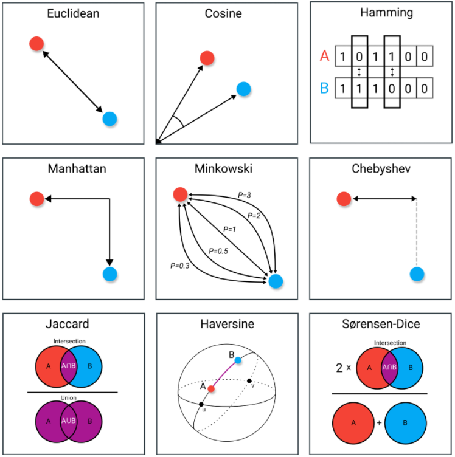

# 📝 분석 일반 General Analysis

### Q01 좋은 feature란 무엇인가요. 이 feature의 성능을 판단하기 위한 방법에는 어떤 것이 있나요?

💡답변

좋은 feature는 데이터셋에서 자주 등장해야하며 분명하고 명확한 의미가 부여되어야 합니다.

> 참고 - [Machine Learning Crash Course - Representation: Qualities of Good Features](https://developers.google.com/machine-learning/crash-course/representation/qualities-of-good-features?hl=ko)

### Q02 "상관관계는 인과관계를 의미하지 않는다"라는 말이 있습니다. 설명해주실 수 있나요?

💡답변

어떤 요인에 의해 x와 y의 값이 동시에 영향을 받아서 변할 수 있습니다. 영향을 받는 외부 요인을 함께 가진다면 x와 y는 상관관계일 수 있지만 이것으로 x와 y의 인과관계를 설명할 수는 없습니다.

> * **상관관계** : 어떤 변인 x의 값과 다른 변인 y의 값이 함께 변할 때, x와 y의 관계 
> * **인과관계** : 어떤 변인 x의 값이 변하면, 그로 인해서 다른 변인 y의 값이 변할 때, x와 y의 관계

### Q03 A/B 테스트의 장점과 단점, 그리고 단점의 경우 이를 해결하기 위한 방안에는 어떤 것이 있나요?

💡답변

A/B 테스트는 임의로 나눈 두집단에게 서로 다른 컨텐츠를 제시한 후 두 집단 중 어떤 집단이 더 놓은 성과를 보이는지 정량적으로 평가하는 방식으로 **무작위 비교연구** 라 불리는 방법을 서비스에 적용하는 방법론을 말합니다. 

A/B 테스트의 장점으로 실제상황에서 고객의 실제 행돌을 측정한다는 것과, 많은 사람들에게 트래픽을 던져 높은 통계적 유의성을 기지고 매우 작은 성능차이도 측정할 수 있습니다.. 또한 상황에 따라 어떤 것이 가장 큰 비중을 차지하는 지 결정함으로, 상충되는 지침이나 질적 사용적합성 결과(Qualitative Usability Findings)사이의 Trade-Off를 해결할 수 있고, 비용이 저렴하다는 것입니다.

단점으로는 테스트를 **많이** , 그리고 **자주** 하면 **단기적으로 손해가 발생** 할 수 있고, A/B 테스트 결과는 계절 변화나 취향 변화 등 **시간의 흐름에 따라** 바뀔 수 있습니다. 그리고 A/B 테스트 **만** 해서는 **지역 최적점** 에 머물게 될 위험이 있습니다. 테스트를 많이 했을때 생기는 단기적인 손해와 계절 변화나 취향 변화에 따라 바뀔수 있다는 단점은 MAB(Multi-Armed Bandit)알고리즘을 사용하여 해결 할수 있습니다.

  > 
  >
  > **A/B 테스트** : 임의로 나눈 두 집단에게 서로 다른 컨텐츠를 제시한 후 두 집단 중 어떤 집단이 더 높은 성과를 보이는지 정량적으로 평가하는 방식으로 "무작위 비교연구"라 불리는 방법을 서비스에 적용하는 방법론을 말함.
  >
  > * A/B 테스트의 장단점 [기내식은수박바 | A/B Testing](https://soobarkbar.tistory.com/139)
  >
  > |                             장점                             |                             단점                             |
  > | :----------------------------------------------------------: | :----------------------------------------------------------: |
  > | 웹사이트 분석의 한 분야로서, **실제 상황** 에서 고객의 **실제 행동을 측정** 함. | 테스트를 **많이** , 그리고 **자주** 하면 **단기적으로 손해가 발생** 할 수 있음. |
  > | A/B 테스트는 각 설계에서 많은 사람들(Boatloads)의 트래픽을 던질 수 있기 때문에, **높은 통계적 유의성** 을 가지고 **매우 작은 성능 차이를 측정** 할수 있음. | A/B 테스트 결과는 계절 변화나 취향 변화 등 **시간의 흐름에 따라** 바뀔 수 있음. |
  > | 상황에 따라 **어떤 것이 가장 큰 비중을 차지하는지** 결정함으로써, 상충되는 지침(Conflicting Guidelines) 이나 질적 사용적합성 결과(Qualitative Usability Findings)사이의 **Trade-Off를 해결**  할 수 있음. | A/B 테스트 **만** 해서는 **지역 최적점** 에 머물게 될 위험이 있음. |
  > |                     비용이 **저렴** 함.                      |                                                              |
  >
  > * 첫번째, 두번째 단점에 대해서는 MAB(Multi-Armed Bandit)알고리즘이라고 불리는 효과적인 해결책이 있음.
  >
  > 참고 : [스타트업테드님 AB 테스트 | 주간 마케팅 3화](https://www.youtube.com/watch?v=XsgrzKQy-q0&ab_channel=%EC%8A%A4%ED%83%80%ED%8A%B8%EC%97%85%ED%85%8C%EB%93%9C%EB%8B%98)
  >
  > * A/B TEST 주의사항
  >   1) 가설이 꼭 필요함.
  >   2) 대상은 임의로 나누어야 함.
  >   3) B/A 테스트와 A/B 테스트는 다르다.
  >   4) **A/B테스트는 목적이 아닌 수단일 뿐이다.** - 최적화의 도구일뿐 큰 그림을 보여주지는 않음.

### Q04 각 고객의 웹 행동에 대하여 실시간으로 상호작용이 가능하다고 할 때에, 이에 적용 가능한 고객 행동 및 모델에 관한 이론을 알아봅시다.

💡답변

 각 고객의 웹 행동에 대하여 실시간으로 상호작용이 가능한 서비스에서 가장 필요한 분석 모델은 **퍼널분석** 이라고 생각합니다. 퍼널 분석 시 측정하려는 목표를 설정하고 목표까지의 단계를 설정하여 고객들의 이탈율과 전환율을 분석함으로 서비스의 문제점에 적절히 대처할 수 있습니다. 해당 웹 서비스가 고객들의 웹 행동에 대해 실시간으로 상호작용이 가능하다고 한다면 더욱 적극적인 개선의 방법을 줄 수 있을 것으로 기대합니다.

> * **퍼널 분석** (Funnel Analysis) : 유저들이 서비스에 들어온 시점부터 우리가 설정한 목표를 달성할 때까지, 단계별 프로세스를 분석하는 방법
>
>   
>
>   * 여기서! 퍼널(Funnel)이란 깔때기를 말하는 것으로 고객들이 서비스를 들어온 순서부터 다음 순서를 가짐.
>     인지(Awareness) - 관심(Interest) - 결정(Decision) - 행동(Action)
>
>   * 퍼널 분석의 3요소
>
>     1. 측정하려는 목표 설정 - 목표는 '구매', '회원가입' 등 다양함.
>
>     2. 목표까지의 단계 설정 - 회원가입이 최종 목적일때 다음의 과정을 가짐.
>
>        웹사이트 방문 앱 다운로드 - 회원가입 페이지로 이동 - 회원가입
>
>     3. 데이터 트래킹 툴 연동 - 구글 애널리틱스 등
>
>   * 이탈률 vs 전환율
>
>     1. 유입을 폭발적으로 늘림.
>        - 100% 중 1%가 구매했을때, 100명에서 1000명으로 늘림.
>     2. 전환율을 개선함.
>        * 100% 중 1%가 구매하는 것에서 10%로 늘리는 것으로 개선함.
>        * 효율적임.
>
>   * **퍼널 단계에서 가장 전환율이 낮은 부분 가장 이탈율이 높은 부분을 개선해야 함.**
>
>     * '회원가입 쿠폰을 준다', '회원 가입 버튼을 쉽게 노출 시킨다' 등 
>
>   참고 : [스타트업테드님 퍼널 분석 | 주간 마케팅 1화](https://www.youtube.com/watch?v=vyYFU-B1X24&ab_channel=%EC%8A%A4%ED%83%80%ED%8A%B8%EC%97%85%ED%85%8C%EB%93%9C%EB%8B%98)
>
> * **지표 추적** : 추가 예정
>
> * **유지율 분석**

### Q05 고객이 원하는 예측모형을 두 가지 종류로 만들었다. 하나는 예측력이 뛰어나지만 왜 그렇게 예측했는지를 설명하기 어려운 random forest 모형이고, 또다른 하나는 예측력은 다소 떨어지나 명확하게 왜 그런지를 설명할 수 있는 sequential bayesian 모형입니다.고객에게 어떤 모형을 추천하겠습니까?

💡답변

암 발생 여부와 같이 예측력이 중요할 경우 `Random Forest`를 추천하고 대출 불가 원인과 같이 설명력이 중요할 경우 `Sequential Bayesian Model`을 추천하겠습니다.

> - 순차적 베이지안 모델(Sequential Bayesian Model)

### Q06 고객이 내일 어떤 상품을 구매할지 예측하는 모형을 만들어야 한다면 어떤 기법(예: SVM, Random Forest, logistic regression 등)을 사용할 것인지 정하고 이를 통계와 기계학습 지식이 전무한 실무자에게 설명해봅시다.

💡답변

좋은 feature는 데이터셋에서 자주 등장해야하며 분명하고 명확한 의미가 부여되어야 합니다.

> 참고 - [Machine Learning Crash Course - Representation: Qualities of Good Features](https://developers.google.com/machine-learning/crash-course/representation/qualities-of-good-features?hl=ko)

### Q07 나만의 feature selection 방식을 설명해봅시다.

💡답변

과거 진행했던 프로젝트에서 한국고용정보원에서 제공하는 대졸자이동경로조사 데이터에서 1,570개의 feature중에 15개의 feature를 선택했던 적이 있습니다. feature selection과정에서 먼저 feature와 target간의 피어슨 상관계수를 확인 하였고, feature중 상관계수가 0.3이상 -0.3이하인 feature를 선택하였습니다. 이때 직업 예측 모델의 성능이 상당히 개선됨을 보았습니다.

> * 피어슨 상관계수
> * 스피어만 상관계수

### Q08 데이터 간의 유사도를 계산할 때, feature의 수가 많다면(예: 100개 이상), 이러한 high-dimensional clustering을 어떻게 풀어야할까요?

💡답변

고차원 군집의 문제는 feature selection을 통해 줄여서 문제를 풀수 있습니다.

> 
>
> * 데이터 유사도 측정하는 방법
>   * 유클리디안 거리 (Euclidean Distance)
>   * 코사인 유사도(Cosine Similarity)
>   * 해밍 거리 (Hamming Distance)
>   * 맨해튼 거리(Manhattan Distance)
>   * 체비쇼프 거리(Chebyshev Distance)
>   * 민코우스키 거리(Minkowski Distance)
>   * 자카드 계수 (Jaccard Index)
>   * 하버사인 공식(Haversine)
>   * 소렌센 다이스 계수(Sørensen-Dice Index)
>
> 출처 - [anweh님의 티스로리 |[python] 데이터 유사성 측정방법](https://anweh.tistory.com/54)

